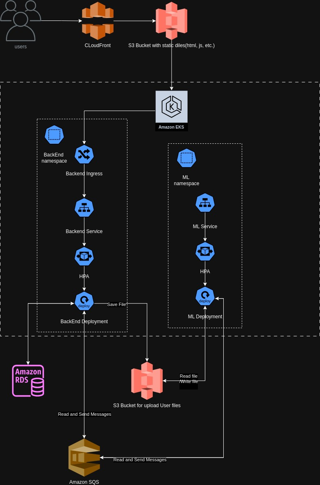

    

### Frontend:

- Frontend files (HTML, CSS, JavaScript) will be stored in an Amazon S3 bucket.
- Amazon CloudFront service will be used for caching and delivering static content from the S3 bucket to end users.
- Amazon Route 53 will be configured to route traffic to the CloudFront distribution.

### Backend:

- A Kubernetes cluster deployed on Amazon EKS will be used for deploying backend services.
- Backend applications will be containerized and stored in an Amazon ECR repository.
- Using Amazon RDS, backend data will be stored in a relational database such as PostgreSQL or MySQL.
- ElastiCache will be used for caching database queries, improving backend response speed.

### ML Section:

- Amazon S3 will be used for storing input files and model outputs.
- ML task containers will be deployed on a Kubernetes cluster.
- Amazon SQS, RabbitMQ or simular queue system will be used for managing ML tasks and regulating processing speed.
- Amazon SageMaker can be used for training, deploying, and monitoring machine learning models.

### Monitoring and Logging:

- Amazon CloudWatch will be configured for monitoring the Kubernetes cluster and containers, as well as tracking metrics and event logs.
- AWS CloudTrail will be used for auditing access to AWS services and tracking user actions.

### Security:

- AWS IAM will be used for managing access to resources.
- AWS WAF can be configured for protection against web attacks.
- Amazon VPC can be used for environment isolation and network security.

### Scaling:

- Automatic scaling of Kubernetes cluster resources using Amazon EKS.
- Utilization of Auto Scaling for automatically scaling other resources, such as EC2 and RDS, according to demand.
